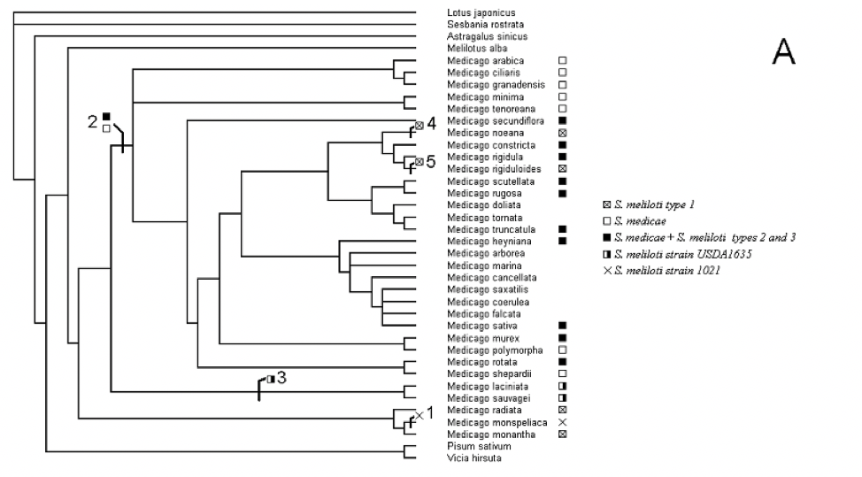

# Hand in 2 - Selection using dN/dS

In this hand in you will analyse the [NORK](nork.meg.zip) data set for selection using the phylogenetic concepts and tools you have learned during the last session. Furthermore, you will answer the exercises of Nielsen and Slatkin Book, Chapter 9. You must write a report answering some questions for the NORK data analysis (below) and the answers for the exercises with a proper explanation (if you type just the numerical answer for example, the exercise will be wrong). Make sure to include detailed information on how the analysis was performed (for example, which substitution model was used, number of bootstraps...). This report must be uploaded on Blackboard in **PDF** format before **Wednesday 28th of October at 11:59 pm**. You are welcomed to work in group, but you must write your own report.

### 1. Molecular phylogenetics of the Medicago genus and patterns of molecular evolution of the NORK protein

#### Background for the study

Legumes have the ability to form symbiotic associations with soil bacteria (a polyphyletic group of bacteria called rhizobia) and thereby use atmospheric N2 as a source of nitrogen. Here we focus on the phylogeny of the plant genus Medicago and on a particular gene in the bacterial symbiotic recognition pathway; the NORK gene. The gene NORK (Nodulation Receptor Kinase) is required to recognize a complex sugar molecule synthesized by microbial rhizobia and start the symbiosis relationship. The C-terminal region of the extracellular contains three Leucine-Rich Repeats (LRRs) which are motifs involved in ligand binding.

#### Data

The alignment of a fragment of the NORK coding sequence (CDS) gene of 32 species of the Medicago genus and  6 other species within the Legumes family is provided in MEGA format ([nork.meg.zip](nork.meg.zip)).

Additionaly, a phylogeny (Fig 1) of the genus Medicago (available as a newick tree file [bena.nwk.zip](bena.nwk.zip) that can be viewed in MEGA). This phylogeny is described fully in 
Béna G et al, (Molecular phylogeny supports the morphologically based taxonomic transfer of the "medicagoid" Trigonella species into the genus Medicago L.)[https://link.springer.com/article/10.1007/s006060170012], Plant Syst Evol 2001, 229:217-236.

>**Fig 1.** independent phylogeny of Medicago genus (based on ITS sequences) and evolutionary transition in symbiotic specificity along the phylogeny. Topology is contained in the newick tree file [bena.nwk.zip](bena.nwk.zip). Ancestral reconstruction was used to infer the symbiotic specificities of each node. Branches where a shift in symbiotic specificity occurred are marked (numbered 1 to 5). See for details Béna G, et al : Medicago – Sinorhizobium symbiotic specificity evolution and the geographic expansion of Medicago. J Evol Biol 2005, 18:1547-1558.

##### 1. Building a phylogeny of the Medicago genus using NORK

1.1. Which substitution model fits the data the best among JC, K2 and Tamura Nei? Why is that? Do you need to account for other parameters (R, I, Gamma…)?

1.2. Build a phylogenetic tree using the NJ algorithm and comment on it by answer the following questions:

- Is the Medicago genus monophyletic under your phylogenetic reconstruction? 

Hint: you can easily visualize different groups in your tree by using the option in “Data/Select Taxa" and Groups” before doing the tree reconstruction. Note that Medicago samples are named by the specific name (starting with a lowercase letter) and the rest by the generic name (starting with an uppercase letter).

- Do you see major changes compared to Fig 1?

- Is there any node that has little support by bootstrap? 

##### 2. Test of evolutionary hypotheses regarding the evolution of NORK in the Medicago genus

2.1. What is the average level of selective constraint (as measured by the ratio =dN/dS) experienced by NORK? Discuss the estimate of you obtain and whether it suggests purifying selection, neutrality or the occurrence of positive selection.

2.2. Is the level of selective constraint (dN/dS) homogeneous in the Medicago phylogeny?
Compare the average dN/dS estimated above with the dN/dS you can estimate in sub groups of the tree. Use the known transitions in symbiotic specificity / mating system evolution in the Medicago genus (see figure below) to investigate whether the selective constraint has changed in specific groups of the Medicago phylogeny. 

Hint: use MEGA to define subgroups in the datasets with each subgroup containing the sequences from the clade you want to examine for  and compute a mean within those subgroups.

### 2. Solve Chapter 9 exercises from Nielsen and Slatkin book
