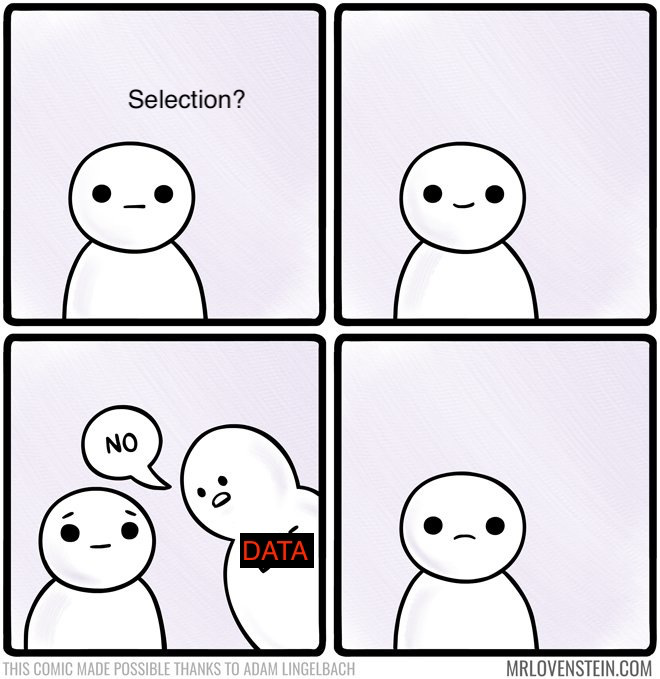

# Hand in 1 - Phylogenetic tree analysis

In this hand in you will analyse [5 datasets](handin1_dataset.zip) using the phylogenetic concepts and tools you have learned during the last sessions. You must write a report answering some questions for each dataset (below) including the trees you build. Make sure to include detailed information on how the tree was produced (substitution model, alignment method, number of bootstraps...) (Fig1). This report must be uploaded in Blackboard in **PDF** format before **Friday 25th of September at 11:59 am**. 

>**Fig 1.** Example of how to include a tree in your report.

**NOTE:** if the sequences are already aligned, create the tree from the original file, don't unalign them and align them again. If you do so, indicate that in your report. 

Short description of the [5 datasets](handin1_dataset.zip) which might be helpful to you when you will interpret some of your results:

1. **primates**: Mitochondrial gene in 5 primates used in many examples in Nei and Kumar.

2. **homomtDNA**: Aligned full mtDNA sequences from a homo sapiens, 2 denisovans and 3 Neanderthals. All samples are from the last 150 kya but one Neanderthal, which is dated to be 400-300 kya old found in Sima de los Huesos, Spain and was not so easy to classify as a Neanderthal. From nuclear DNA we know that: 

- Humans splitted from Neanderthals and Denisovans 700-500 kya
- Neanderthals splitted from Denisovans 400-300 kya
- The 3 Neanderthals in this data set belong to the same group, so they are all Neanderthals

3. **whales**: Whale phylogeny data set discussed in the book. It is from the gamma-fibronogen gene in 16 mammalian species. It should be in reading frame so it can be analysed as coding. 

4. **BRCA1**: Orthologue genes to the human breast cancer susceptibility gene (BRCA1) from 23 different rodent species. It is in reading frame.

5. **EKAF**: Protein coding sequences from mouse, gorilla, chimpanzee and human. This protein is suspected to give humans the hability to lie and fake stories.  

### 1. Primates

1.1. Reproduce the NJ and UPGMA trees from the Nei and Kumar book (Fig 1).

>**Fig 2.** Nei and Kumar book figure for the primate dataset.

1.2. Why are the branch lengths longer when using Kimura substitution model compared to p distances model? 

1.3. What does it mean to “bootstrap an internal node”? How do you interpret the boostrap values in the previous trees? Are they different among trees?

1.4. Build a Maximum Parsimony tree. Does the topology agree with distance methods? Try to run it with a few (50 or 100) bootsraps

**NOTE:** In my case, MEGAX crashes every time I try to incorporate boostrap estimation in the MP tree. If it happens to you, try to get someone else’s tree or don’t worry about it. 

### 2. HomomtDNA

2.1. Which substitution model is the best for this data? What is the transition/transversion bias? And the gamma parameter?

2.2. Build a tree using NJ and 1,000 bootstrap replicates

2.3. Is the topology as you expected? Exploit the phylogenetic relationship between Denisovans, Neanderthals and Modern Humans (some details explained in the data set description above) and comment your bootstrap evidence

### 3. Whales

3.1. Build trees using UPGMA, NJ, ML and MP

3.2. Do you get the same tree topology and bootstrap values?

3.3. Which methods provide the largest bootstrap support? Is this what you expected?

### 4. BRCA1

4.1. Make two phylogenetic trees using different methods

4.2. Are they significantly different when comparing bootstrap values? (assume that a bootstrap value above 70% is significant)

4.3. Is the phylogeny well resolved, i.e. are most bootstrap values > 80%?

### 5. EKAF

5.1. This is a protein that has been evolving in mammals at the same speed (constant evolutionary rate). Which tree algorithm you think should be used? Why?

5.2. Estimate two phylogenetic trees using the tree algorithm you decided: one for synonymous positions and one for non-synonymous. In order to be able to select for that, when you choose to build a tree, under “substitution model”, in “substitution type”, you must select “syn-Nonsynonymous”. You will see that another drop-down menu appears that will give you the option to choose between synonymous or non-synonymous sites. For these trees, don’t worry about the substitution model (Jukes-Cantor, Kimura…), go ahead with the default options. Are the trees different? Why do you think they are different?

5.3. Translate the DNA sequence into a protein sequence. Align these proteins and save your result as a MEGA (.meg) file. Then, construct a tree with the protein aligned sequences. Does the tree look most like the synonymous or non-synonymous tree from question 5.2? Why?

5.4. BONUS EXERCISE (it is not mandatory to include it in the hand in). In MEGAX, open the file in the ALIGN menu. Select a sequence (the human will do) and BLAST it. Alternatively, you can open the file in a text editor (Sublime, textEdit, notepad...) copy the human sequence and paste it in [BLAST](https://blast.ncbi.nlm.nih.gov/Blast.cgi?PROGRAM=blastn&PAGE_TYPE=BlastSearch&LINK_LOC=blasthome) and do a manual blast search. Which sequence is the EKAF homologous to? Surprised? Do you think this protein deserves it's name?
