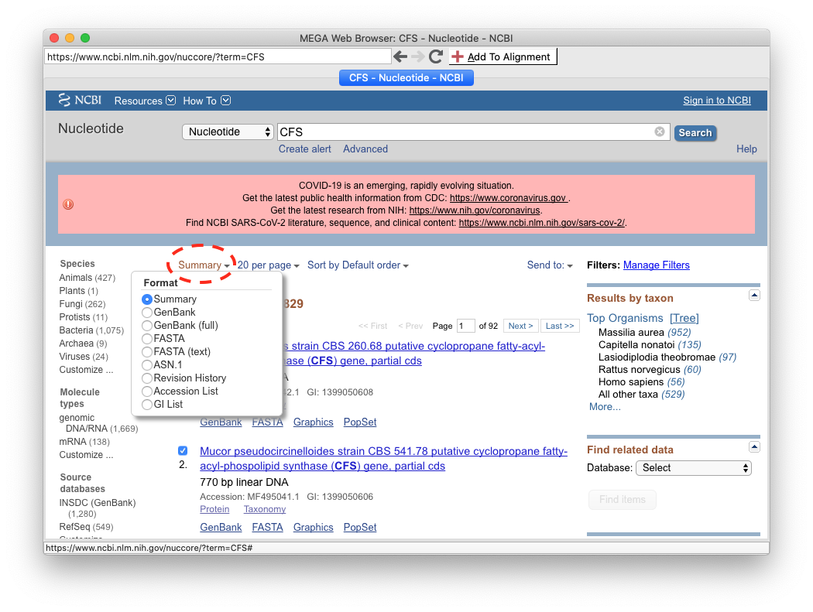
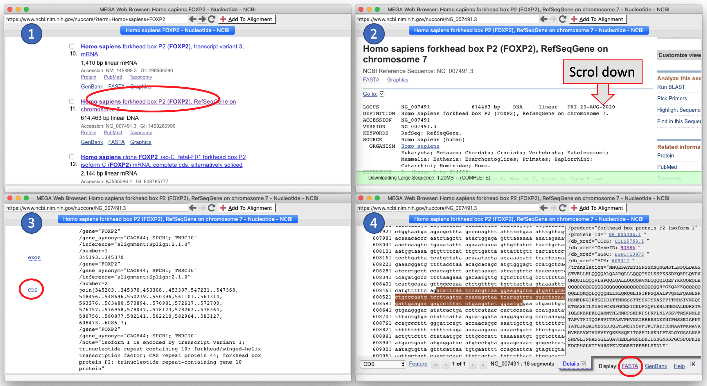
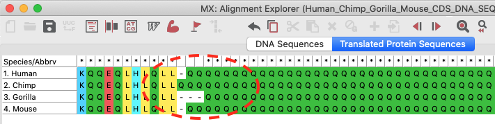
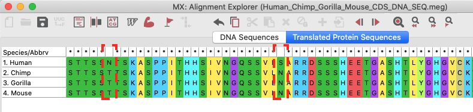

# Friday Week36

## Work plan

During this TA session you are going to learn how to retrieve sequences (DNA, RNA, protein) and information about them from public datasets, align those sequences and finally compute a pairwise distance matrix with MEGAX. For each step, you are going to follow a tutorial to understand the basics and then, you will apply what you've learnt with a case example. I suggest to take the protein FOXP2 as a case example, but you are totally free to choose any other DNA, RNA or protein sequence. 

### 1. Understanding PubMed and GenBank

GenBank is a useful database that contains DNA, RNA and protein sequences publicly available that we will access through MEGAX to download sequences of interest. You can read more about it [here](https://www.ncbi.nlm.nih.gov/genbank/). 

In order to use GenBank efficiently, as other databases such as [PubMed](https://pubmed.ncbi.nlm.nih.gov) used to search for papers, it is a good idea to use specific search fields. These can be specified as e.g. [Author], [pdat] (publication time) and [Title] and use logical operators to combine search terms, e.g. AND, OR, NOT. For example, try to search “Zhao[Author] AND Wu[Author] AND Yu[Author] AND coronavirus[Title] AND 2020[pdat]” on [GenBank](https://www.ncbi.nlm.nih.gov/genbank/). Which paper comes up?

By searching papers in [PubMed](https://pubmed.ncbi.nlm.nih.gov) and [GenBank](https://www.ncbi.nlm.nih.gov/genbank/), answer the following questions:

1. Find and download the paper of the first sequence of the human genome by the International Human Genome Sequencing Consortium or the one assembled by Craig Venter et al in 2001. How many pages is the paper? Where was it published? How can the sequence be obtained?
2. Find the paper on the high coverage archaic Denisovan sequence published by Svante Pääbo's group published in 2012 and answer the same questions. Who were the Denisovans?
3. How many sequences from the dolphin (you might want to use the latin name) can you find? You can choose any other animal!
4. Find the Taxonomic position of Dolphins and find the number of DNA sequences deposited in GenBank for some of the dolphin species
5. Find sequences from FOXP2. What can you learn about this protein?

### 2. Retrieving sequences from GenBank and Aligning them with MEGAX

#### 2.1. Retrieving sequences DIRECTLY from GenBank and Aligning them with MEGAX

In this section we are going to access GenBank from MEGAX to retrieve sequences and Align them using different multiple sequence aligners included in MEGAX.

Follow [2. Align Sequences](https://www.megasoftware.net/web_help_10/index.htm#t=Part_I_Getting_Started%2FA_Walk_Through_MEGA%2FAligning_Sequences.htm) tutorial from [MEGAX-Help](https://www.megasoftware.net/web_help_10/index.htm#t=Introduction.htm)

There are some parts of the tutorial that are wrong. Here you have some fixies:

1. In the **Aligning Sequences by ClustalW** section, there is a step that says

    ```Exit the Alignment Explorer by selecting Data | Exit Aln Explorer from the main menu.```
    
    Instead of **Exit Aln Explorer**, you will find **Quit**
    
2. In the **Aligning Sequences Using Muscle** there is a sentence that tells you that

    ```Near the bottom of the MUSCLE - AppLink window, you will see a row called Alignment Info. You can read information about the Muscle program.```
    
    But I could not find it. If you can't neither, skip this step


3. In the **Obtaining Sequence Data from the Internet (GenBank)** section, when it tells you to look for CFS sequence, I suggest that you look for any sequence you might be interested in. In my case I looked for the Neanderthal, Denisovan and Human mitochondrial DNA. If you follow what I've done, be aware that since they are big sequences, aligning them is going to take some time than smaller protein sequences.  
    
    
4. In the **Obtaining Sequence Data from the Internet (GenBank)** section, you will see that the tutorial says

    ```If you have checked more than one box: locate the Display Settings dropdown (located near the top left-hand side of the page directly under the tab headings).```
    
    You just have to click on **Summary** drop down menu (Fig1) and follow the next indications. Be aware that once you press **Fasta (text)** it automatically applies it, so you don't need to press any **Apply button**.
    

    

    >**Fig1.** Summary drop down menu location

#### 2.2. Retrieving sequences BY SEQUENCE HOMOLOGY from GenBank using BLAST and Aligning them with MEGAX

In this section, in comparison to the previous one, we are going to choose a single sequence (query) and search other sequences that are homologous to that one (targets) using BLAST. Then, we are going to retrieve those sequences from GenBank and align them as we did in the previous section. 

BLAST (basic local alignment search tool) is an algorithm and program for comparing primary biological sequence information, such as the amino-acid sequences of proteins or the nucleotides of DNA and/or RNA sequences. A BLAST search enables a researcher to compare a subject protein or nucleotide sequence (called a query) with a library or database of sequences, and identify library sequences that resemble the query sequence above a certain threshold. [Wikipedia](https://en.wikipedia.org/wiki/BLAST_(biotechnology)).

Thus, we can search sequences that are homologous to a sequence of our interest using BLAST through MEGAX. Here you have a small tutorial of how to do so:

1. Open MEGAX
2. Click on **ALIGN** on the top menu and select **Edit/Build Alignment**. Press **OK** and then **DNA**
3. On the top menu you have a shortcut for **Query GenBank**. Otherwise you can click on **Web** and select **Query GenBank **.
4. As you did in the [2. Align Sequences](https://www.megasoftware.net/web_help_10/index.htm#t=Part_I_Getting_Started%2FA_Walk_Through_MEGA%2FAligning_Sequences.htm) tutorial, look for a protein. The Human FOXP2 could be an example and retrieve that sequence to MEGAX
5. Click on your sequence (it has to turn yellowish)
6. Similarly as you did to access GenBank, click on **Do BLAST search**. In the Query text box, you should see your sequence. If not, it means that you haven't selected your sequence.
7. Scroll down and click on **BLAST**
8. On the results page, scroll down and unselect the **select all** option. Then, select the sequences you might be interested in and click on the **GeneBank** link on top of the sequence results.
9. Finally, follow what you did in the [2. Align Sequences](https://www.megasoftware.net/web_help_10/index.htm#t=Part_I_Getting_Started%2FA_Walk_Through_MEGA%2FAligning_Sequences.htm) tutorial to retrieve the sequences you selected in BLAST and align those sequences

### 3. Get your case example sequences and align them

Now is the time for you to decide which sequence you want to investigate. Maybe you want to learn how haemoglobin has changed in different mammal species? Maybe you want to compare different SARS-CoV2 viruses, some from Denmark and some from US? Up to you! I prepared these exercises with the **CDS** (**C**o**D**ing **S**equence) of FOXP2 and you are welcome to follow my example. It is important that you obtain a CDS DNA sequence in order to translate DNA to protein. If you don't, if you get a whole DNA sequence, be aware that the steps in which we translate the protein might not make sense for you, especially when we align sequences. 

You should also be aware that when you retrieve sequences, they should have similar lengths. If you get, for example, the CDS DNA sequence of the Human FOXP2, but you get the whole mRNA sequence of the Chimp FOXP2, then, you will get lots of gaps in your alignment, since you are not dealing with the same type of sequence. 

You might find an entry for the CDS of the gene you are interested. However, if you only find the mDNA sequence entry you will have to look for the CDS coordinates in the GenBank page of the gene (Fig2).



>**Fig2.** How to get the CDS sequence form the RefSeq entry in GenBank. Red circles show where you must click.

Once you made your mind about which sequence you are going to work on...

1. Retrieve sequences directly form GenBank or search for homology in BLAST to select your sequences. In my case I selected the Chimp, Gorilla and Mouse sequences to compare. 
2. Align the DNA sequences. Try to change some options before running the alignment and see how this changes your output. Do you see many gaps? What about base substitutions? Get a feeling of how good or how bad those sequences align. 

I found these pairwise differences

|       |  Human  |  Chimp  |  Goril  |
|:-----:|--------:|--------:|--------:|
| Human |         |         |         |
| Chimp |      11 |         |         |
| Goril |      14 |      18 |         |
| Mouse |     149 |     144 |     142 |

3. Right click on each sequence and click on **Delete Gaps** if the option is available. This will undo the alignment. 
4. Select all DNA sequences and click on **Translated Protein Sequences**. This step will translate DNA sequences to protein sequences. 
5. Align the protein sequences. Ask yourself the same questions as in step 2. Which sequences align better? DNA or protein? Why?

I found these pairwise differences

|       |  Human  |  Chimp  |  Goril  |
|:-----:|--------:|--------:|--------:|
| Human |         |         |         |
| Chimp |       3 |         |         |
| Goril |       4 |       3 |         |
| Mouse |       4 |       3 |       4 |

6. Export your alignments in **.meg** (MEGA) format. Remember: Data > Export Alignment > MEGA format

The protein differences I've found I show them in Fig3 below. The deletions are predicted to not change much the function of the protein (Fig3a). However, the substitutions you see on Fig3b, they are thought to be essential for brain development and have been linked to correct speetch in humans and grammar learning. They were thought to be a difference between humans and Neanderthals that would explain why humans were able to develop complex language and thus be so successfull compared to our arhcaic relatives. However, Neanderthals share the same substitutions with us and then, this hypothesis was proved to be wrong, at least for this gene. You can read more on internet about this ([link](https://www.nature.com/news/2007/071018/full/news.2007.177.html)).




>**Fig3.** Indels and substitutions in the FOXP2 gene.

### 4. Estimate pairwise distances among sequences

Follow the section **Estimating Evolutionary Distances Using Pairwise Distance** from the [3. Estimating Evolutionary Distances](https://www.megasoftware.net/web_help_10/index.htm#t=Part_I_Getting_Started%2FA_Walk_Through_MEGA%2FEstimating_Evolutionary_Distances.htm) tutorial from [MEGAX-Help](https://www.megasoftware.net/web_help_10/index.htm#t=Introduction.htm). 

Then, repeat what you've learned in this tutorial with you own example.

I computed the number of differences of the FOXP2 CDS for human, chimp and gorilla sequences aligned with MUSCLE. These are the values I obtained with p-distance:

for DNA:

|       |  Human  |  Chimp  |  Goril  |
|:-----:|--------:|--------:|--------:|
| Human |         |         |         |
| Chimp | 0.00372 |         |         |
| Goril | 0.00373 | 0.00420 |         |
| Mouse | 0.06536 | 0.06434 | 0.06218 |


for protein:

|       |     Human    |     Chimp    |     Goril    |
|:-----:|-------------:|-------------:|-------------:|
| Human |              |              |              |
| Chimp | 0.0027972028 |              |              |
| Goril | 0.0028050491 | 0.0000000000 |              |
| Mouse | 0.0042016807 | 0.0014005602 | 0.0014044944 |

Try to draw a tree in which the branch lengths are proportional to the distances. Can you?

## Extra info

1. Paper that investigate the COVID19 spread in the early times of the first outbreak and study of some particular cases in Iceland

    Gudbjartsson D, Helgason A, Jonsson H, Magnusson O, Melsted P, Norddahl G et al. [Spread of SARS-CoV-2 in the Icelandic Population](https://www.nejm.org/doi/full/10.1056/NEJMoa2006100). New England Journal of Medicine. 2020;382(24):2302-2315.

2. Repository of all sequenced SARS-CoV2 worldwide with interactive phylogenetic tree of the sequences ([link](https://nextstrain.org/ncov/global))

