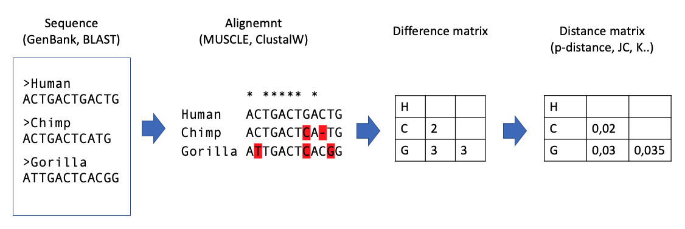
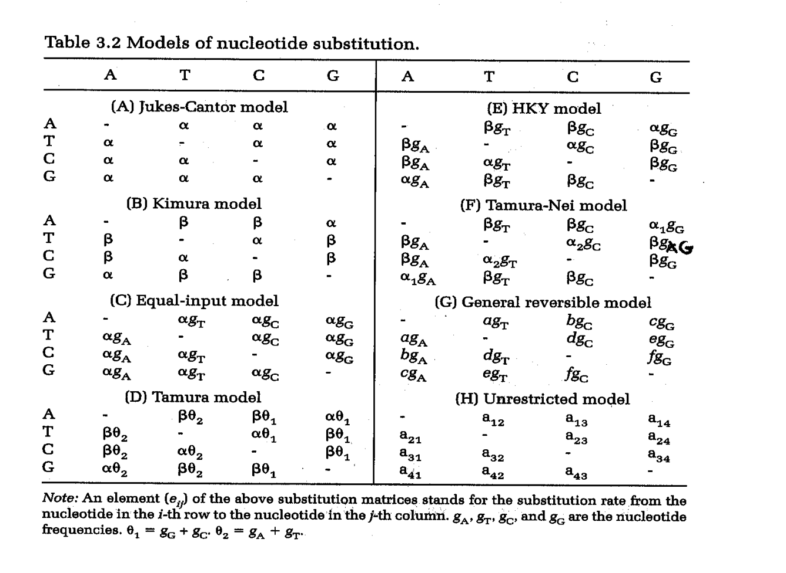
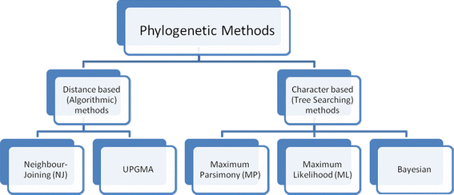
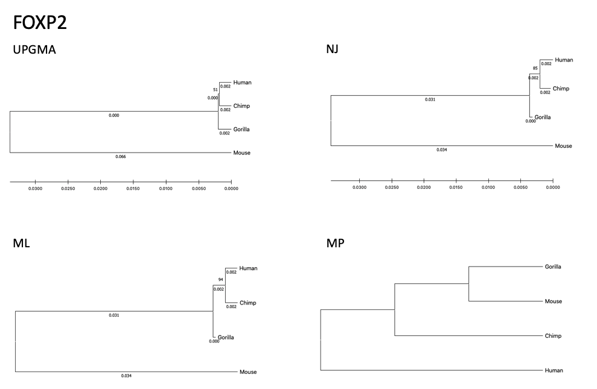
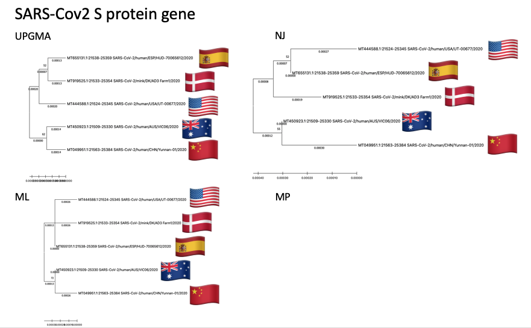

# Friday Week37

## Work plan

Remember from last week that we did part of the **steps of the phylogenetic analysis**, from sequence retrieve to distance matrix computation (Fig1).



>**Fig 1.** Steps of the phylogenetic analysis

This week we are going to explore which substitution model fits best our data, which tree building algorithm to use and how to assess confidence to that tree. During this exercise it is important that you keep all the results (screenshots with notes in a text editor, such as word, for example) that you obtain in the different parts in order to be able to compare them.

### 1. Testing substitution model

Here we are going to test which substitution model is the best of our data.

1. Download [`primates.meg`](primates.meg) which is the one from Chapter 3 in Nei and Kumar.
2. Open MEGAX and import this data to MEGAX. This can be easily done dragging the file to the main MEGAX window or cliking on the **DATA** button. 
3. Click **MODELS** on the main MEGAX window and click **Find Best DNA/Protein Models (ML)...**

This will estimate likelihoods for each substitution model available and rank them according to the Bayesian information criterion (BIC). This value is similar to AIC. For now just accept that the smallest value is best.

1. Which model is best for this data? Save the Table of model scores since when running some of the tree building methods, you may not be able to use the best model.
2. What does G and I mean?
3. What is R? and what is in the 4 columns following the R column?
4. List the main differences between JC, Kimura, HKY, and Tamura/Nei models, based on Table 3.2 a,b,e below (Fig2). Relate what you find to question 3 above. 




>**Fig 2.** Substitution models' parameters

From now on, before you start any analysis you are well advised to determine the best substitution model first

### 2. Tree building

#### 2.1. Tree building MEGAX tutorial



>**Fig 3.** Tree algorithm classes.

Follow [Building Trees From Sequence Data](https://www.megasoftware.net/web_help_10/index.htm#t=Part_I_Getting_Started%2FA_Walk_Through_MEGA%2FBuilding_Trees_From_Sequence_Data.htm) tutorial from [MEGAX-Help](https://www.megasoftware.net/web_help_10/index.htm#t=Preface.htm).

There are some parts of the tutorial that are wrong. Here you have some fixies:

1. In the **Building a Neighbor-Joining (NJ) Tree** section, there is a step that says

    ```Click Compute to accept the defaults for the rest of the options and begin the computation.```
    
    Instead of **Comput**, you will find **OK**

2. You don't need to do the **Printing the NJ Tree (For Windows users), Printing the NJ Tree (For Mac users) or Constructing a MP Tree using the Heuristic Search**.

3. The last exercise **Examining Data Editing Features** just tells you how to not use some of the sequences to build a tree without removing the sequences form the raw file. I just want to make clear the purpose of the exercise. A part from that, when it says 

    ```Click the Close button.```
    
    Instead of **Close**, you will find **OK**

#### 2.2. Tree building with your case example

Last week you had a case example. Some of you took FOXP2 from some great apes and mouse, but some of you were using the Denisova, the Neanderthal and the Human mtDNA or you were comparing some SARS-CoV2 sequences. Now it's time to get them back! If you did not save the sequences or the alignments, you can get the [FOXP2 sequences](Human_Chimp_Gorilla_Mouse_FOXP2_CDS_DNA_SEQ.fas) I got last time. I also ran a phylogenetic analysis with the [S protein gene of the SARS-Cov2](SARS-Cov2_gene_DNA_SEQ.meg) sequenced from diferent patients around the world (Australia, USA, Spain, Denmark and China). If you are more interesetd on this data, you can also use it for this exercise. Be aware that you must align them, before building the tree model or run the model selection since they are just the raw sequences. Alternatively, you can always choose any sequence that you like!

For the dataset you decided:

1. Check which substitution model fits the best for those sequences
2. Build a UPGMA tree with the best substitution model that it allows (UPGMA can not be run with all substitution models).
3. Questions:

    1. Which substitution model should you use?
    2. What does the substitution method you chose assume?
    3. Rebuild the tree the same way but choose 1,000 bootstrap replicates. What is bootstrap? What does it then mean if a branch is supported by 90%?

4. Play with the tree format in the tree explorer
5. Save the tree
6. Repeat 1-5 using Neighbourjoining, Parsimony and Maximum likelihood tree bulding algorithms (check the questions on the next point and don't automatically produce all the trees at once).
7. Questions: 
    
    1. About NJ: Is NJ tree similar than UPGMA? Are bootstrap values similar to the ones from UPGMA? Try rooting the tree and see how much it can change
    2. About MP: Here you are also estimating the tree by guessing at a good tree followed by close-neighbour interchange. I suggest that you use level 1 which is equivalent to nearest-neighbour interchange. What is this, by the way? I suggest reducing the number of bootstraps to 100 as the method is slower. How does the Parsimony tree differ from the distance based trees?
    3. About ML: Here you should also use fewer bootstrap replicates, because the method is much slower. Remember to save the tree for later use, call it ML

### 3. Results

#### 3.1. FOXP2 dataset

The best model:

- Best model    : HKY (Hasegawa-Kishino-Yano)
- paramteres    : 9
- BIC           : 7353.666
- AICc          : 7290.166

for UPGMA and NJ I used:

- Model choosen : TN93 (Tamura-Nei)
- parameters    : 10
- BIC           : 7361.402
- AICc          : 7290.849




>**Fig 4.** Tree results from FOXP2

#### 3.2. SARS-Cov2 S protein gene dataset

The best model was:

- Best model    : T92 (Tamura 3 parameters)
- paramteres    : 9
- BIC           : 10518.312
- AICc          : 10447.730



>**Fig 5.** Tree results from SARS-Cov2 S protein gene
