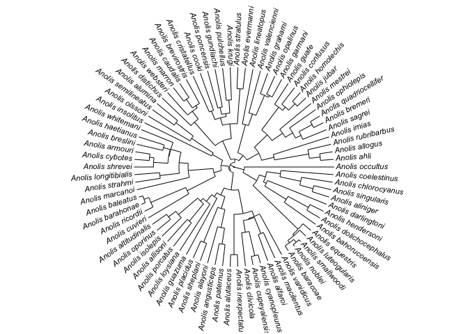
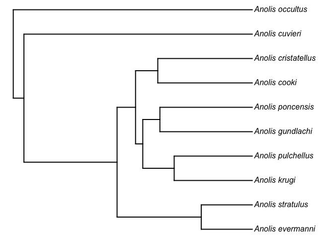
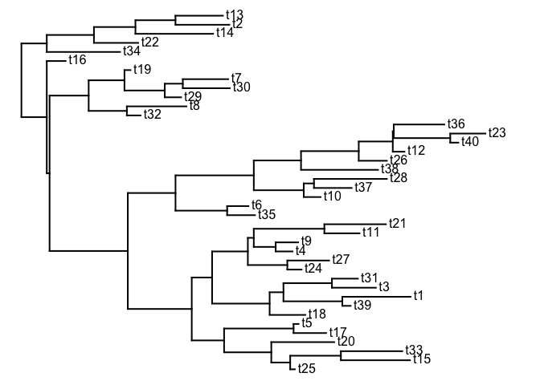

Introduction to phylogenies in R
================

###### Author : Liam J. Revell

###### Adapted by: Moisès Coll Macià

This tutorial gives a basic introduction to phylogenies in the R
language and statistical computing environment.

## R phylogenetics packages

R phylogenetics is built on the contributed packages for phylogenetics
in R, and there are many such packages. Let’s begin today by installing
a few critical packages, such as ape, phangorn, phytools, and geiger. To
get the most recent CRAN version of these packages, you will need to
have R 3.3.x installed on your computer\!

``` r
R.version
```

    ##                _                           
    ## platform       x86_64-apple-darwin15.6.0   
    ## arch           x86_64                      
    ## os             darwin15.6.0                
    ## system         x86_64, darwin15.6.0        
    ## status                                     
    ## major          3                           
    ## minor          6.3                         
    ## year           2020                        
    ## month          02                          
    ## day            29                          
    ## svn rev        77875                       
    ## language       R                           
    ## version.string R version 3.6.3 (2020-02-29)
    ## nickname       Holding the Windsock

> MOI: I installed other packages that the original R exercice didn’t
> installed but that I needed to install. When I did install different
> packages, I got a message telling me to restart Rstudio. Whenever I
> said yes, I had to load the packages again. Thus, I said NO, and it
> worked. I recomend that you do the same.

> MOI: While you install R packages, they might fail. You can read the
> warning messages and some times you will see that it tells you why it
> failed. Usually, it is because it was not able to fain a particular
> package. In order to overcome this problem, you can add another
> package to be installed in the below R code chunk before the package
> that had problems and that should be fine.

``` r
#install.packages("ape")
#install.packages("phangorn")
#install.packages("phytools")
#install.packages("geiger")
#install.packages("devtools") #package added by Moi
#install.packages("maps")     #package added by Moi
```

We can verify that we have the same versions of these packages installed
by using the base function `packageVersion`:

``` r
packageVersion("ape")
```

    ## [1] '5.4.1'

``` r
packageVersion("phangorn")
```

    ## [1] '2.5.5'

``` r
packageVersion("phytools")
```

    ## [1] '0.7.70'

``` r
packageVersion("geiger")
```

    ## [1] '2.0.7'

I strongly recommend that you use the package versions shown above (or
more recent versions) rather than older editions.

Installing automatically from CRAN using `install.packages` installs not
only your target package - but also any libraries on which that package
depends, if that package has not yet been installed.

It is also possible to install more recent development versions of some
R packages from GitHub using the package devtools. For instance, we can
install the most recent development version of phytools from GitHub as
follows:

``` r
library(devtools)
```

    ## Loading required package: usethis

``` r
install_github("liamrevell/phytools")
```

    ## Skipping install of 'phytools' from a github remote, the SHA1 (7b375aa7) has not changed since last install.
    ##   Use `force = TRUE` to force installation

## The `"phylo"` object in R

Now we’ve installed critical packages (ape, phangorn, phytools, geiger).
The most important core package for phylogenies in R is called “ape”,
which stands for **A**nalysis of **P**hylogenetics and **E**volution in
R.

``` r
## load ape
library(ape)
```

“ape” does many different things. To get started let’s read a ‘toy’
example vertebrate tree from a Newick text string:

``` r
## read tree from string
text.string<-
    "(((((((cow, pig),whale),(bat,(lemur,human))),(robin,iguana)),coelacanth),gold_fish),shark);"
vert.tree<-read.tree(text=text.string)
```

We can visualize this phylogeny in R in a number of different ways.
Let’s plot this phylogeny in three different styles:

``` r
plot(vert.tree,no.margin=TRUE,edge.width=2)
```

<!-- -->

``` r
## load phytools
library(phytools)
```

    ## Loading required package: maps

``` r
roundPhylogram(vert.tree)
```

<!-- -->

``` r
plot(unroot(vert.tree),type="unrooted",no.margin=TRUE,lab4ut="axial",
    edge.width=2)
```

<!-- -->

The object created in memory when we simulate or estimate a phylogeny,
or read one from an input file, is a list of class `"phylo"`.

Remember, a list is just a customizable object type that can combine
different objects of different types. For instance, a list might have a
vector of real numbers (with mode `"numeric"`) as its first element; and
then a vector of strings (with mode `"character"`) as its second
element; and so on. Assigning our tree with a special class, `"phylo"`,
is just a convenient way to tell special functions in R how to treat
that object.

An object of class `"phylo"` has at least three parts. These are
normally hidden, for instance, just typing the name of your `"phylo"`
object does not give you the structure in memory, as it does for many R
objects:

``` r
vert.tree
```

    ## 
    ## Phylogenetic tree with 11 tips and 10 internal nodes.
    ## 
    ## Tip labels:
    ##   cow, pig, whale, bat, lemur, human, ...
    ## 
    ## Rooted; no branch lengths.

Instead, something called an S3 `print` method is activate to print to
screen a summary of some of the important attributes of that object.

We can, however, reveal the internal structure of our object as follows:

``` r
str(vert.tree)
```

    ## List of 3
    ##  $ edge     : int [1:20, 1:2] 12 13 14 15 16 17 18 18 17 16 ...
    ##  $ Nnode    : int 10
    ##  $ tip.label: chr [1:11] "cow" "pig" "whale" "bat" ...
    ##  - attr(*, "class")= chr "phylo"
    ##  - attr(*, "order")= chr "cladewise"

To understand the structure of a `"phylo"` object a little bit more
clearly, let’s read in a much simpler phylogeny, and then decompose it
to its essential components:

``` r
tree<-read.tree(text="(((A,B),(C,D)),E);")
plotTree(tree,offset=1)
tiplabels()
nodelabels()
```

<!-- -->

Here I have overlain the ‘node numbers’ - the indices from the `"phylo"`
object `edge` which is a matrix containing the starting & ending node
indices for each edge:

``` r
tree$edge
```

    ##      [,1] [,2]
    ## [1,]    6    7
    ## [2,]    7    8
    ## [3,]    8    1
    ## [4,]    8    2
    ## [5,]    7    9
    ## [6,]    9    3
    ## [7,]    9    4
    ## [8,]    6    5

We can see:

1)  that `tree$edge` has a number of rows equal to the number of edges
    (8) in this tree; and

2)  that each edge starts and ends with a unique pair of indices.
    Furthermore, by convention the indices 1 through N for N tips
    correspond with the tip nodes (species) in the tree.

The other components of importance are the vector `tip.label` and an
integer `Nnode` which gives the number of interior nodes in the tree:

``` r
tree$tip.label
```

    ## [1] "A" "B" "C" "D" "E"

``` r
tree$Nnode
```

    ## [1] 4

An object of class `"phylo"` also (by definition) has at least one
attribute - its class. This is just a value to tell various methods in R
what to do with an object of this type. For instance, if we call the
method `plot`, R knows to use the method `plot.phylo` in the R package
`“ape”`.

An object of class `"phylo"` can also have other components, the most
common of which is `edge.length` (a vector of class `"numeric"`
containing all the edge lengths). In addition, other elements &
attributes can be added for special types of phylogenetic trees.

## Writing & reading phylogenetic trees

We can easily write & read trees to & from files, for example if we
download the file [anole.tre](anole.tre):

``` r
anolis.tree<-read.tree(file="anole.tre")
anolis.tree
```

    ## 
    ## Phylogenetic tree with 82 tips and 81 internal nodes.
    ## 
    ## Tip labels:
    ##   Anolis_ahli, Anolis_allogus, Anolis_rubribarbus, Anolis_imias, Anolis_sagrei, Anolis_bremeri, ...
    ## 
    ## Rooted; includes branch lengths.

``` r
plotTree(anolis.tree,ftype="i",fsize=0.6,lwd=1)
```

<!-- -->

This is a tree containing:

``` r
Ntip(anolis.tree)
```

    ## [1] 82

82 species of lizards in the neotropical lizard genus Anolis.

We can also write trees to file. For instance, we can easily write our
five taxon tree from before to a simple text file in Newick style:

> MOI: Next command will create a text file name example.tre in your
> folder with the tree in netweek format. You can check it yourself, but
> the command “cat(…” just reads the file you indicate.

``` r
write.tree(tree,file="example.tre")
## this is what our file looks like (you can open it to check)
cat(readLines("example.tre"),sep="\n")
```

    ## (((A,B),(C,D)),E);

## Plotting, & manipulating trees

There are a range of ways in which we can plot trees in R.

For instance, we can easily create an *unrooted cladogram* of the
*Anolis* phylogeny we read in earlier. Let’s do that:

``` r
plot(unroot(anolis.tree),type="unrooted",cex=0.6,
    use.edge.length=FALSE,lab4ut="axial",
    no.margin=TRUE)
```

<!-- -->

Another convenient plotting method for large *rooted* trees is a
circular or ‘fan’ tree:

``` r
plotTree(anolis.tree,type="fan",fsize=0.7,lwd=1,
    ftype="i")
```

<!-- -->

It is pretty easy to drop species from the tree, or to extract clades.
For instance the anoles from Puerto Rico (in this phylogeny) consist of
*A. cristatellus*, *A. cooki*, *A. poncensis*, *A. gundlachi*, *A.
pulchellus*, *A. stratulus*, and *A. evermanni* (which form a clade), as
well as *A. occultus* and *A. cuvieri*.

First, let’s find them:

``` r
pr.species<-c("cooki","poncensis","gundlachi","pulchellus","stratulus",
    "krugi","evermanni","occultus","cuvieri","cristatellus")
ii<-sapply(pr.species,grep,anolis.tree$tip.label)
ii
```

    ##        cooki    poncensis    gundlachi   pulchellus    stratulus        krugi 
    ##           25           24           23           22           20           21 
    ##    evermanni     occultus      cuvieri cristatellus 
    ##           19           82           48           26

``` r
pr.species<-anolis.tree$tip.label[ii]
pr.species
```

    ##  [1] "Anolis_cooki"        "Anolis_poncensis"    "Anolis_gundlachi"   
    ##  [4] "Anolis_pulchellus"   "Anolis_stratulus"    "Anolis_krugi"       
    ##  [7] "Anolis_evermanni"    "Anolis_occultus"     "Anolis_cuvieri"     
    ## [10] "Anolis_cristatellus"

``` r
plotTree(anolis.tree,type="fan",fsize=0.7,lwd=1,
    ftype="i")
add.arrow(anolis.tree,tip=ii,arrl=1)
```

<!-- -->

Now let’s prune these species from the tree:

``` r
anolis.noPR<-drop.tip(anolis.tree,pr.species)
plotTree(anolis.noPR,type="fan",fsize=0.7,lwd=1,
    ftype="i")
```

<!-- -->

Or, we can extract the clade that includes all but two of the species:

``` r
node<-fastMRCA(anolis.tree,"Anolis_evermanni",
    "Anolis_cristatellus")
pr.clade<-extract.clade(anolis.tree,node)
plotTree(pr.clade,ftype="i")
```

<!-- -->

Now, let’s prune everything in the tree except these species:

``` r
pr.tree<-drop.tip(anolis.tree,
    setdiff(anolis.tree$tip.label,pr.species))
plotTree(pr.tree,ftype="i")
```

<!-- -->

Finally, we can do it *interactively* using `collapseTree`

> MOI: For this to work, you need to run the two following commands
> directly on the console. To quite the interactive mode, I had to press
> ESC.

``` r
#anolis.pruned<-collapseTree(anolis.tree)
#plotTree(anolis.pruned,type="fan",fsize=0.7,lwd=1, ftype="i")
```

## Binary & polytomous trees

“ape” and most other phylogenetics packages are equipped to handle
phylogenies that are binary or multifurcating; however not all functions
will be. We can easily check if our tree is binary, and convert between
binary & multifurcating trees.

``` r
t1<-read.tree(text="((A,B,C),D);")
plot(t1,type="cladogram")
```

<!-- -->

``` r
## check if binary
is.binary.tree(t1)
```

    ## [1] FALSE

``` r
## randomly resolve polytomies
t2<-multi2di(t1)
plot(t2,type="cladogram")
```

<!-- -->

``` r
is.binary.tree(t2)
```

    ## [1] TRUE

## Miscellaneous (rotating nodes, re-rooting, etc…)

Lots of other manipulations are possible in R, but here are some simple
ones:

> MOI: the `seed` is to fix a random process. For example, if you
> randomly draw a number between 1 to 10, every time you run it, you
> will get a different number. However, if you set the `seed` you will
> always get the same result. To see that, you can comment the
> `set.seed(1)`, run the chunk multiple times (to see that you get
> different trees), and then uncomment the `set.seed(1)` and run again
> multipe times (to see taht you allways get the same result).

``` r
set.seed(1) ## so we all have the same thing!
## rotating nodes
tree<-rtree(n=40)
plotTree(tree,node.numbers=T)
```

<!-- -->

``` r
## first, rotate about node #52
rt.52<-rotate(tree,52)
plotTree(rt.52)
```

<!-- -->

``` r
## now rotate all nodes
rt.all<-rotateNodes(tree,"all")
plotTree(rt.all)
```

<!-- -->

``` r
## ok, now let's re-root the tree at node #67
rr.67<-root(tree,node=67)
plotTree(rr.67)
```

<!-- -->

``` r
## this creates a trifurcation at the root
## we could instead re-root at along an edge
rr.65<-reroot(tree,65,position=0.5*tree$edge.length[which(tree$edge[,2]==65)])
plotTree(rr.65)
```

<!-- -->

We can also change the position of the root interactively. For instance:

> MOI: For this to work, you need to run the two following commands
> directly on the console

``` r
# rr.interactive<-reroot(tree,interactive=TRUE)
# plotTree(rr.interactive)
```

## Comparing trees

We can, for example, check to see if our trees are equal. Trees with
rotated nodes are equal. Re-rooted trees are not; however they are the
same if unrooted. For example:

``` r
## check if tree & rt.all are equal
all.equal(tree,rt.all)
```

    ## [1] TRUE

``` r
## check if tree & rr.67 are equal
all.equal(tree,rr.67)
```

    ## [1] FALSE

``` r
## check if unrooted tree & rr.67 are equal
all.equal(unroot(tree),unroot(rr.67)) ## this is a bug
```

    ## [1] TRUE

## Multiple trees

Finally, it is sometimes useful to store multiple phylogenies in a
single object. This would be the case, for example, if we had a set of
trees in a posterior sample from Bayesian phylogeny inference; or if we
wanted to replicate a simulation analysis across a large number of
phylogenies.

Multiple trees are stored as an object of class `"multiPhylo"`. This is
just a list of objects of class `"phylo"`, with the class attribute
`"multiPhylo"`. Many, but not all, functions in “ape”, “phytools”, and
other R packages can be applied to both `"phylo"` and `"multiPhylo"`
objects. For instance:

``` r
anolis.trees<-c(anolis.tree,anolis.noPR,pr.clade,pr.tree)
print(anolis.trees,details=TRUE)
```

    ## 4 phylogenetic trees
    ## tree 1 : 82 tips
    ## tree 2 : 72 tips
    ## tree 3 : 8 tips
    ## tree 4 : 10 tips

``` r
## round the edge lengths of the tree to 1 digits
anolis.trees<-roundBranches(anolis.trees,digits=1)
## write to file
write.tree(anolis.trees,file="example.trees")
## this is what it looks like:
cat(readLines("example.trees"),sep="\n")
```

    ## ((((((((Anolis_ahli:0.8,Anolis_allogus:0.8):0.7,Anolis_rubribarbus:1.4):2.1,Anolis_imias:3.5):0.8,((((Anolis_sagrei:1.5,(Anolis_bremeri:0.7,Anolis_quadriocellifer:0.7):0.9):0.4,Anolis_ophiolepis:1.9):0.5,Anolis_mestrei:2.4):0.8,(((Anolis_jubar:0.7,Anolis_homolechis:0.7):0.5,Anolis_confusus:1.3):0.3,Anolis_guafe:1.5):1.7):1.1):0.8,((((Anolis_garmani:1.2,Anolis_opalinus:1.2):0.1,Anolis_grahami:1.3):1.3,Anolis_valencienni:2.6):0.7,Anolis_lineatopus:3.4):1.8):0.4,(((Anolis_evermanni:1.3,Anolis_stratulus:1.3):2.1,(((Anolis_krugi:2,Anolis_pulchellus:2):0.8,(Anolis_gundlachi:2.3,Anolis_poncensis:2.3):0.4):0.2,(Anolis_cooki:2.4,Anolis_cristatellus:2.4):0.6):0.5):0.9,(((Anolis_brevirostris:1.7,(Anolis_caudalis:1,Anolis_marron:1):0.6):0.2,Anolis_websteri:1.8):0.6,Anolis_distichus:2.4):1.9):1.2):0.2,(((((Anolis_alumina:1.6,Anolis_semilineatus:1.6):1.3,Anolis_olssoni:2.9):1.6,Anolis_insolitus:4.5):0.7,((((Anolis_whitemani:2.1,((Anolis_haetianus:1.6,Anolis_breslini:1.6):0.4,((Anolis_armouri:0.9,Anolis_cybotes:0.9):0.3,Anolis_shrevei:1.2):0.9):0):0.6,(Anolis_longitibialis:1.5,Anolis_strahmi:1.5):1.2):0.5,Anolis_marcanoi:3.2):1.5,(((Anolis_baleatus:0.3,Anolis_barahonae:0.3):0.3,Anolis_ricordii:0.6):2.3,Anolis_cuvieri:2.8):1.9):0.5):0.5,(((((((Anolis_altitudinalis:1,Anolis_oporinus:1):0.6,Anolis_isolepis:1.6):1.5,(Anolis_allisoni:1.8,Anolis_porcatus:1.8):1.3):0.2,Anolis_loysiana:3.3):0.5,Anolis_guazuma:3.9):0.3,((Anolis_placidus:1.1,Anolis_sheplani:1.1):2.3,(Anolis_alayoni:2.3,(Anolis_angusticeps:1.3,Anolis_paternus:1.3):1):1.1):0.8):0.5,((Anolis_alutaceus:0.7,Anolis_inexpectatus:0.7):2.4,(((Anolis_clivicola:2,(Anolis_cupeyalensis:0.5,Anolis_cyanopleurus:0.5):1.5):0.7,(Anolis_alfaroi:1.7,Anolis_macilentus:1.7):1):0.1,Anolis_vanidicus:2.8):0.4):1.5):1.1):0.1):0.3,(((((Anolis_baracoae:0.4,(Anolis_noblei:0.1,Anolis_smallwoodi:0.1):0.2):0.2,Anolis_luteogularis:0.5):0.1,Anolis_equestris:0.6):3.8,(((Anolis_bahorucoensis:2.3,(Anolis_dolichocephalus:0.9,Anolis_hendersoni:0.9):1.4):1.5,Anolis_darlingtoni:3.8):0.2,(((Anolis_aliniger:1.1,Anolis_singularis:1.1):0.8,Anolis_chlorocyanus:1.9):1.3,Anolis_coelestinus:3.2):0.8):0.4):1,Anolis_occultus:5.4):0.6);
    ## ((((((((Anolis_ahli:0.8,Anolis_allogus:0.8):0.7,Anolis_rubribarbus:1.4):2.1,Anolis_imias:3.5):0.8,((((Anolis_sagrei:1.5,(Anolis_bremeri:0.7,Anolis_quadriocellifer:0.7):0.9):0.4,Anolis_ophiolepis:1.9):0.5,Anolis_mestrei:2.4):0.8,(((Anolis_jubar:0.7,Anolis_homolechis:0.7):0.5,Anolis_confusus:1.3):0.3,Anolis_guafe:1.5):1.7):1.1):0.8,((((Anolis_garmani:1.2,Anolis_opalinus:1.2):0.1,Anolis_grahami:1.3):1.3,Anolis_valencienni:2.6):0.7,Anolis_lineatopus:3.4):1.8):0.4,(((Anolis_brevirostris:1.7,(Anolis_caudalis:1,Anolis_marron:1):0.6):0.2,Anolis_websteri:1.8):0.6,Anolis_distichus:2.4):3.1):0.2,(((((Anolis_alumina:1.6,Anolis_semilineatus:1.6):1.3,Anolis_olssoni:2.9):1.6,Anolis_insolitus:4.5):0.7,((((Anolis_whitemani:2.1,((Anolis_haetianus:1.6,Anolis_breslini:1.6):0.4,((Anolis_armouri:0.9,Anolis_cybotes:0.9):0.3,Anolis_shrevei:1.2):0.9):0):0.6,(Anolis_longitibialis:1.5,Anolis_strahmi:1.5):1.2):0.5,Anolis_marcanoi:3.2):1.5,((Anolis_baleatus:0.3,Anolis_barahonae:0.3):0.3,Anolis_ricordii:0.6):4.2):0.5):0.5,(((((((Anolis_altitudinalis:1,Anolis_oporinus:1):0.6,Anolis_isolepis:1.6):1.5,(Anolis_allisoni:1.8,Anolis_porcatus:1.8):1.3):0.2,Anolis_loysiana:3.3):0.5,Anolis_guazuma:3.9):0.3,((Anolis_placidus:1.1,Anolis_sheplani:1.1):2.3,(Anolis_alayoni:2.3,(Anolis_angusticeps:1.3,Anolis_paternus:1.3):1):1.1):0.8):0.5,((Anolis_alutaceus:0.7,Anolis_inexpectatus:0.7):2.4,(((Anolis_clivicola:2,(Anolis_cupeyalensis:0.5,Anolis_cyanopleurus:0.5):1.5):0.7,(Anolis_alfaroi:1.7,Anolis_macilentus:1.7):1):0.1,Anolis_vanidicus:2.8):0.4):1.5):1.1):0.1):0.3,((((Anolis_baracoae:0.4,(Anolis_noblei:0.1,Anolis_smallwoodi:0.1):0.2):0.2,Anolis_luteogularis:0.5):0.1,Anolis_equestris:0.6):3.8,(((Anolis_bahorucoensis:2.3,(Anolis_dolichocephalus:0.9,Anolis_hendersoni:0.9):1.4):1.5,Anolis_darlingtoni:3.8):0.2,(((Anolis_aliniger:1.1,Anolis_singularis:1.1):0.8,Anolis_chlorocyanus:1.9):1.3,Anolis_coelestinus:3.2):0.8):0.4):1.6);
    ## ((Anolis_evermanni:1.3,Anolis_stratulus:1.3):2.1,(((Anolis_krugi:2,Anolis_pulchellus:2):0.8,(Anolis_gundlachi:2.3,Anolis_poncensis:2.3):0.4):0.2,(Anolis_cooki:2.4,Anolis_cristatellus:2.4):0.6):0.5);
    ## ((((Anolis_evermanni:1.3,Anolis_stratulus:1.3):2.1,(((Anolis_krugi:2,Anolis_pulchellus:2):0.8,(Anolis_gundlachi:2.3,Anolis_poncensis:2.3):0.4):0.2,(Anolis_cooki:2.4,Anolis_cristatellus:2.4):0.6):0.5):2.3,Anolis_cuvieri:5.7):0.3,Anolis_occultus:6);

Many other tasks are also possible in R phylogenetics. For an overview,
read the CRAN Phylogenetics Task View. Also check out my blog:
<http://blog.phytools.org>, or review the PDF manuals of different R
packages such as ape, phytools, and phangorn.

Written by Liam J. Revell. Last updated 31 July 2017.
