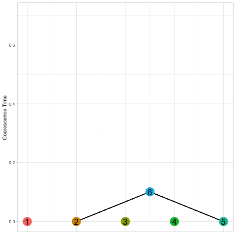
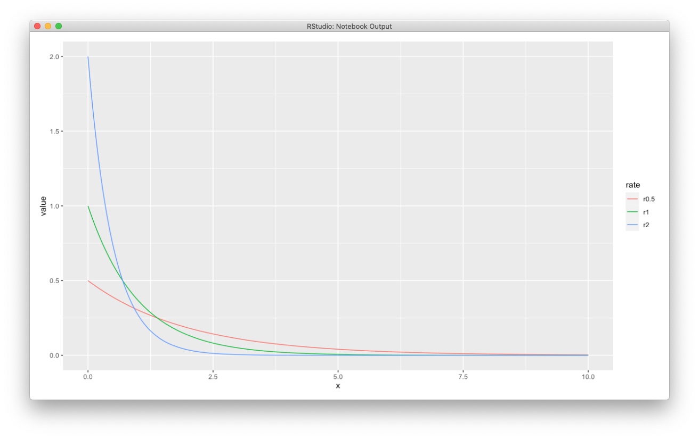

###### This tutorial was obtained from [Fernando Racimo's GitHub](https://github.com/FerRacimo/CopenhagenTutorial/blob/master/CoalTutorial.md). I modified the original version to fit the tutorial to my class needs. 

Exercises in coalescent theory
===============

Based on notes by Ida Moltke.

## 1 - Simulating	a	coalescence	tree	assuming	a	constant	population	size

The	purpose	of	this first	exercise	is	to	make	sure	it	is	clear	how	a	coalescence tree	is	simulated. We will use R as a calculator so a little familiarity with this language will help. In this exercise you will simulate coalescence (using R) but drawing the tree on a piece of paper. You will have to do a step by step process, similar as what is shown in the gif below:



>**Fig 1.** coalescence tree simulation

1. Start	by	drawing	on a piece of paper a	small circle	for	each	of	the	five	gene	copies. They should be lined up on	an	invisible horizontal line	and you should leave enough	space	above the circles for	
drawing	a	tree	above them (which we will do shortly).	We will henceforth call these five circles "nodes" and label them 1,2,3,4,5

2. Also,	make	a	list	of	the	node	names.	You	can	either	do	this	by	hand	or	you	can	do	it	in	R	by	
simply	writing:

```
nodes = c(1,2,3,4,5) # make the list and call it nodes
nodes # print the list
```

3. Sample	which	two	nodes	will	coalesce	first	(going	back	in	time)	by	randomly	picking	two	of	the	
nodes.	You	can	either	do	this	by	hand	or	you	can	do	it	in	R	by	typing:

```
nodecount = length(nodes) # save the number of nodes in the variable nodecount
tocoalesce = sample(1:nodecount, size=2) # sample 2 different nodes in node list
nodes[tocoalesce[1]] # print the first node sampled
nodes[tocoalesce[2]] # print the second node sampled
```

If	you	used	R	then	make	sure	you	understand	what	the	R	code	does	before	moving	on.

4. Sample	the	time	it	takes	before	these	two	nodes	coalesce	(measured	from	previous	
coalescence	event in	units	of	2N)	by	sampling	from	an	exponential	distribution	with	rate	equal	
to	nodecount*(nodecount-1)/2	where	nodecount	is	the	number	of	nodes	in	your node	list.	Do	
this	in	R	by	typing:

```
coalescencerate = nodecount*(nodecount-1)/2 # calculate the coalescent rate
coalescencetime = rexp(1, rate=coalescencerate) # sample from exponential w. that rate
coalescencetime
```

Make sure	you	understand	what	the	R	code	does	before	moving	on.

5. Now	draw	a	node	that	is	the	sampled amount	of	time	further	up	in	the	tree	than	the currently	
highest node	(so	if	the	currently	highest	node	is	drawn	at	height	T	then	draw	the	new	one	at	
height	T plus the	sampled	coalescence	time)	and	draw	a	branch	from	each	of	the	nodes	you	
sampled	in	step	3	to	this	new	node	indicating	that	these	two	nodes	coalesce at	this	time.	

6. Next,	make	an	updated	list	of	the	nodes	that	are	left	by	removing	the two	nodes	that	
coalesced	and	instead	adding	the	newly	drawn	node	that represents	their	common	ancestor.	
You	can	call	the	new	node	the	next	number	not	used	as	a	name	yet	(e.g. if	this	is	the	first	
coalescence event you	can	call	it	6, if	it	is	the	second	coalescence	event you	can	call	it	7	etc.).	
You	can	either	do	this	by	hand	or	in	R.	If	you	want	to	do	it	R	you	can	do	it	as	follows:

```
nodes <- nodes[-tocoalesce] # remove the two nodes that coalesced
nodes <- c(nodes,2*5-length(nodes)-1) # add the new node
nodes # print the new list
```

If	you	used	R	then	make	sure	you	understand	what	the	R	code	does	before	moving	on.

7. If	you	only	have	one	node	left	in	your	list	of	remaining	nodes	you	are	done.	If	not,	go	back	to	
step	3.	

In	the	end you	should	have	a	tree,	which	is	a	simulation	of	a	coalescence	tree. Try	to	do	this	a	
couple times	until	you	feel	like	you	know	how	it	is	done	and	understand	how the coalescence process works	(if after	drawing	a	few	trees still	don’t	understand,	then	feel	free	to	ask for	help!).

To speed up the process, I wrote an R funtion which is going to tell you the nodes that coalesce, the time it took, and the total coalescence time. Furthermore, it is going to produce a plot like the one you have in the gif above. You must download the [`coalmoi.R`](coalmoi.R) code and change the path to it in the next R command:

```
source("/Users/au552345/Documents/Tree_of_life_2020/Week40/friday/coalmoi.R")
```

Then, you can run the following commands a bunch of times to see what happens:

```
coalsim <- sim_coal_moi()
plot_coal(coalsim[[1]], coalsim[[2]])
```
Run it several times (10-15) and note down the time to the first and coalescence event (not the total coalescence time). You can have a vector in R for the first coalescence event and another one for the last. For example:

```
first <- c(0.142387438557091, 0.195287438557091)
last  <- c(0.296367282979198, 1.760553551753784)
```

Based	on	the	results you	get, answer	the	following	questions.

1) Which	coalescence event takes	the	longest on	average (the	first coalescence event,	the	
second,	…,	or	the	last)? 

You can compute that by doing:

```
mean(first)
mean(last)
```

2) Is	that	what	you	would	expect? Recall that the	mean	of	an	exponential	distribution	with rate	lambda	is	1/lambda	
and	the	coalescence rate	when	there	are	n nodes	left	is	n(n-1)/2.	So	the	mean	is	2/(n(n-1)),	so
for	instance	for	when	there	are	5	nodes	left	the	mean	coalescent	time	is	2/(5(5-1))=0.1. For this question and the rest, look at Figure 2 to get a sence of the mean and the variance of the exponential distributions.

3) Which	coalescence event	time	seems to	vary	the	most? 

You can use R again:

```
var(first)
var(last)
```

4) Is	that	what	you	would	expect? Recall that, if we have a random variable that follows an exponential distribution with rate lambda, then its variance is equal 1/(lambda^2).



>**Fig 2.** Exponentail distributions depending on different rates
