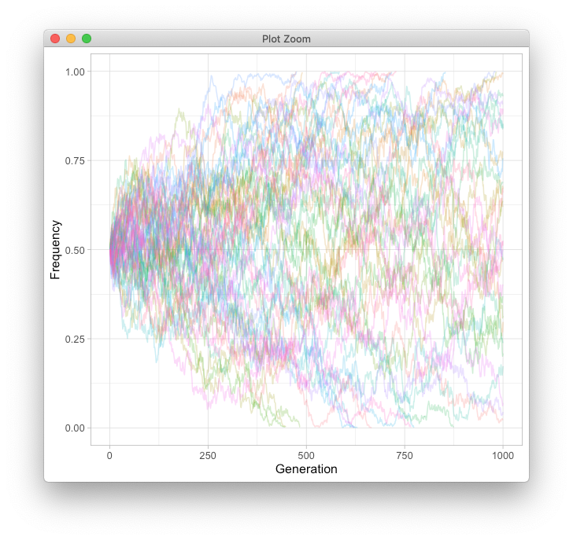

###### This tutorial was obtained from [Fernando Racimo's GitHub](https://github.com/FerRacimo/CopenhagenTutorial/blob/master/WrightFisherTutorial.md). I modified the original version to fit the tutorial to my class needs. 

# Exercises using the Wright-Fisher model

(based on scripts by Graham Coop)


Start running the RStudio and load the following R file (you must download the [`simulateWF.R`](simulateWF.R) code and change the path to it in the next R command):

```
source("/Users/au552345/Documents/Tree_of_life_2020/Week40/friday/simulateWF.R")
```

This script contains a set of functions for simulating the Wright-Fisher model, both forwards and backwards in time. We'll play with these functions to gain some intuition about how the model works.

## 1 - Thinking forwards in time: 2 alleles

First, we'll run a Wright-Fisher model beginning with a population with two alleles. The population will have size 2N = 10 (so N = 5 diploids) and we'll run the simulation for 15 generations:

```
WF_twoalleles(5,15)
```

What do you observe plotted on the screen?

### Q1

Run this line 5 times, and record how many times the red allele fixes, how many times the blue allele fixes and how many times the population remains polymorphic (both the blue and the red allele still co-exist). Compare your results with your neighbor. Does there seem to be a preference for whether the blue or red allele fixes? Why do you think this is so? Hint: check the frequency of the two alleles at the beginning of the simulation.

You may have noticed that a vector of values also gets printed into the console every time we run this simulation. This is the allele counts of the blue allele. We can use this vector to trace the frequency of the blue allele over time:

```
bluecounts <- WF_twoalleles(5,15)
bluefreq <- bluecounts / (2 * 5)
plot(bluefreq,ylim=c(0,1),type="b",col="blue",pch=19,xlab="generations",ylab="Blue frequency")
```

### Q2

Repeat exercise **Q1** but with N=3 and N=10. Do alleles tend to "fix" faster when N is large or when N is small?


## 2 - Thinking forwards in time: many alleles

We can also run a Wright-Fisher model with more than two alleles. The function below begins with a population in which each individual contains two distinct alleles, which are different from all other alleles in the population.

```
WF_manyalleles(5,15)
```

### Q3

What happens to the allelic diversity (number of alleles present) as time goes forward? Are there more or less heterozygotes at the end of the simulation than at the beginning?

### Q4

Check what happens to allelic diversity over time, when N = 3 and when N = 10.

### Q5 (OPTIONAL)

Once you have finished all the exercises (including the coalescence exercises) and you still have steam and motivation, you can try to create your own genetic drift simulation function. We will reproduce what you've got at the end of **Q1** (a line plot with the frequency trajectory over generations of an allele with a certain starting frequency due to genetic drift).

This function will:

1. Compute the frequency `f` of a bialelic allele in generation `g (`f_g`) in a population of size `N` given `f_{g-1}`
2. Compute `f_g` for `G` generations, starting with a frequency value of `f_0` (up to this point, it is similar to what you've done in **Q1**)
2. Replicate the experiment `R` times
3. Plot the results of the `f_g` trajectories in all `r`

you should end up with a plot similar to Figure 1. This way, you are going to experiment whith higher flexibility how the different variables (`f_0`, `N`, `G`) affect the mean and variance of the ultimate `f_G`. 

I created an R function as example from which I got Figure 1. You can run it if you download the [geneticdrift_moi.R](geneticdrift_moi.R) file and you run  the following commands (skip if you want to try to build your own script):

```
library(tidyverse)
source("/Users/au552345/Documents/Tree_of_life_2020/Week40/friday/geneticdrift_moi.R")
gf <- genetic_drift(N = 2*500, f_0 = 1/2, G = 1000, R = 50)
plot_genetic_drift(gf)
```



>**Fig 1.** Genetic drift simulation (N = 1000, f_0 = 1/2, G = 1000, R = 50)

Here are the steps I followed in case you need some inspiration to build your own function:

1. Sample `N` number of alleles from a binomial distribution with probability `f_{g-1}` to sample allele 1 and `1-f_{g-1}` to sample allele 0.

HINT: you can do that with `rbinom()` or `sample()` functions

2. Calculate the frequency of the allele 1 that you sampled in the previous step. This is actually your `f_g`. 

3. Repeat the previous process a number of `G` generations starting from `f_0`. Remember all frequencies `f_g` (from `f_0` to `f_G`) computed in a vector which is `G` long. This will give you the trajectory of the frequencies for an allele.

4. Repeat the previous experiment for `R` replicates of an allele. Remember all frequencies for all alleles `f_rg` computed in a vector which is `G` * `R` long. This will give you the trajectories of the frequencies for a bunch of alleles. At the same time as `f_rg`, remember the replicate `r` and the generation `g` in two independent vectors. 

5. Construct a dataframe with the 3 vectors you got before

6. Plot your data

Take into consideration that the higher `G` or `R` are, the slower the script is going to be. If you want to increase them, go step by step or reduce the other parameters. Maybe start by `N = 250`, `G = 100` or `R = 50`.

Run some simulations and ask yourself questions like the ones you answered before or...

What happens when you change `f_0`, `N`, `G` to the number of fixed/lost alleles? What about the mean time to fixation/lose? Do alleles get fixed or lost earier with higher `N`? What about the variance to the final frequency? Are all those results symetrical for inverse values of `f_0` (i.e., `f_0` = 0.1 or `f_0` = 0.9)? 

If you want some help answering those, you can use the following function from [geneticdrift_moi.R](geneticdrift_moi.R).

```
gf_stats(gf)
```

which will print:

1. Mean frequence and variance frequence of all replicates at the last generation recorded
2. Counts of fixed, intermediate and lost alleles
3. Mean and variance on the generations to allele fixation
4. Mean and variance of generations to allele loss
5. Histogram of allele frequency

## 3 - Thinking backwards in time

So far, we've been running the Wright-Fisher model forwards in time. We began with a population of individuals with (possibly) distinct alleles and observed what happened as we approached the present. Now, we'll start in the present and go backwards in time. Specifically, we'll aim to trace the lineages of particular individuals that exist in the present and see how they "coalesce" (find a common ancestor) in the past.

### Q5

We will trace the genealogy of 3 lineages in a population of size N = 10 (2N = 20) over 20 generations:

```
track_lineages(N.vec=rep(10,20), n.iter=1, num.tracked=3)
```

Repeat this simulation 10 times. For each simulation, record the time between the present and the first coalescent event, and the time between the first coalescent event and the second coalescent event (i.e. the most recent common ancestor of all 3 lineages). You can ignore simulations where lineages have not coalesced at generation 20. Which of the two times tends to be larger? Why do you think this is?

### Q6

Check what happens to the coalescence rate, when N = 7 and when N = 20. Do lineages coalesce faster or slower with larger population size?


