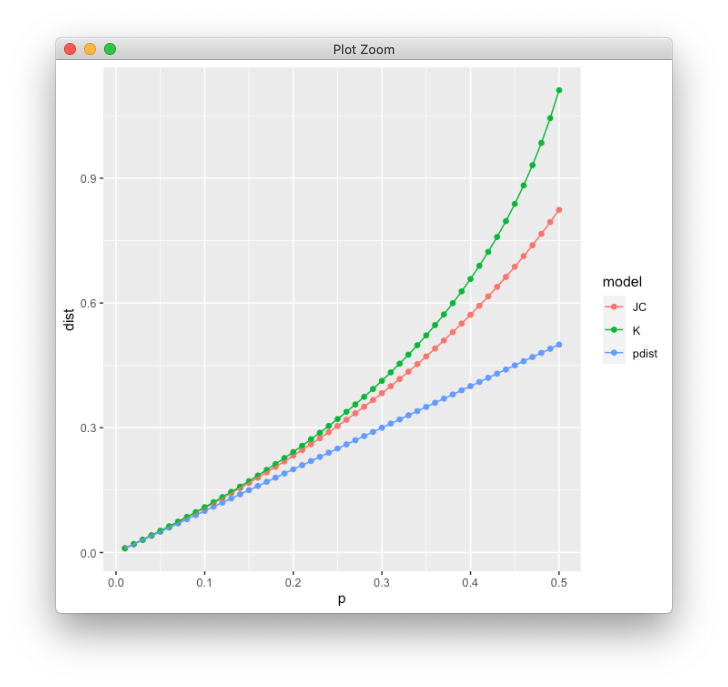

# Tuesday Week40

## Work plan

### 1. Nielsen and Slatkin book exercises - Chapter 1, 2, 3

During this TA you will have time to answer the Nielsen and Slatkin book exercises, Chapter 1, 2, 3. Since it's quite some, try to do some work at home and leave the exercises you find more difficult to do in class. 

Because the exercises can't be publicly distributed, you will find two links in this week's directory under the "Materials" section in Black Board, one for the exercises and the other for the google docs.

Solutions to odd number exercises can be found at the end of the book and solutions to even numbers can be found [here](http://people.bu.edu/msoren/BI515_2014/EvenNumberedSolutions.pdf).

### 2. Assignment discussion

We will comment the most common problems that I could find in the assignments and you will be able to ask questions that you might still have.

1. R code for the distance model plot:

```
library(tidyverse)

Q = 0.25 #proportion of transversions
P = 1-Q  #proportion of transitions

data.frame(p = seq(0.01, 0.5, 0.01)) %>%
  mutate(pdist = p,
         JC    = (-3/4) * log( 1-((4/3)*p)), 
         K     = ((1/2)*log(1/(1-(2*P*p)-(Q*p))))+((1/4)*log(1/(1-(2*Q*p))))) %>%
  gather(model, dist, pdist, JC, K) %>%
  ggplot() +
  geom_point(aes(x = p, y = dist, color = model)) +
  geom_line(aes(x = p, y = dist, group = model, color = model))
```



>**Fig 1.** Substitution model comparison (p-distance, JC and K2)


2. In case you are wondering about the homomtDNA dataset questions, here you have some papers that will give you the answer to those:

2.1. [Paper](https://www.nature.com/articles/nature12788) published in 2014 describing the sequencing and analysis of the mtDNA from a specimen found in Sima de los Huesos

2.2. [Paper](https://www.nature.com/articles/nature12788) published in 2016 describing the sequencing and analysis of the nuclear DNA from the same specimen found in Sima de los Huesos and comparison to the mtDNA results

2.3. [Journal article](https://www.theguardian.com/science/2017/jul/18/did-human-women-contribute-to-neanderthal-genomes-over-200000-years-ago) that talks about the finding

2.4. [Paper](https://science.sciencemag.org/content/369/6511/1653/tab-pdf) published last week (25 Sep 2020) describing the sequencing and analysis of the Y chromosome from late Neanderthals which have followed similar evolutionary patterns than the Neanderthal mtDNA.

2.5. [Perspective](https://science.sciencemag.org/content/369/6511/1565) about the Neanderthal Y chromosome paper by Mikkel Heide Schierup.


