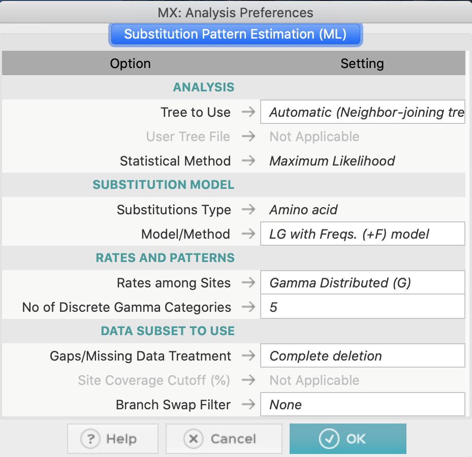

# Friday Week47

## Work plan
For this week's exercize, we will study the effect of protein evolution on tree inference. We will calculate the amino acid substitution matrix for each gene and correlate these values with physio-chemical properties of amino acids. 

### Background
Amino acids have various physio-chemical properties (such as polarity or volume) that determine their role in a protein sequence.

>**Fig 1.** Basic amino acid properties.

We can assume that a gene experiences significant evolution if the amino acid substitutions occurring in the protein are between amino acids that differ significantly with respect to their properties. Substitutions between amino acids that are similar would have little functional effect and can therefore be considered neutral, while increasing difference between amino acids can cause significant beneficial or deleterious effects on protein function. This thought led scientists to come up with various measures that quantify differences between amino acids. You can have a look at some of these indices here: [link](https://www.genome.jp/aaindex/). For this exercize, we will be using one of the first amino acid dissimilarity matrices devised by [Miyata (1979)](https://link.springer.com/article/10.1007/BF01732340), based on amino acid volume and polarity.

>**Fig 2.** Miyata's dissimilariy matrix.

### Data files
#### 1. [`genes.zip`](genes.zip)
The folder contains protein alignments in fasta format for 8 genes across the 23 yeast species from the Rokas articles.
#### 2. [`miyata.csv.zip`](miyata.csv.zip)
Miyata amino acid dissimilarity matrix.

### Strategy
#### 1.  Load the protein alignment into MEGA and estimate the amino acid substitution matrix and the pyhlogenetic tree.
Load the data into MEGA and choose `Analyse` (as the data are already aligned), go to `MODELS` and select `Estimate Substitution Model (ML)...`. Set as:

Run and save the resulting subsitution matrix for correlation estimation. Then select `Construct/Test Maximum Likelihood Tree...` from the `PHYLOGENY` menu using the same settings as for the substitution model. Save the tree for later inspection.

#### 2.  Estimate the correlation between the substitution matrix the Miyata matrix.
You can use excel to calculate the correlation using the `CORREL(array1, array2)` function or load the matrices into R and use the `cor.test(array1, array2)` function.
#### 3.  Repeat for every gene.

### Questions
#### 1. What are the correlation values for each gene?
#### 2. Is the sign of the correlation coefficient expected or not? Why?
#### 3. Visually compare trees of genes with the highest and lowest correlation coeffcient. Which tree is more similar to the tree observed in the Rokas 2013 paper?

