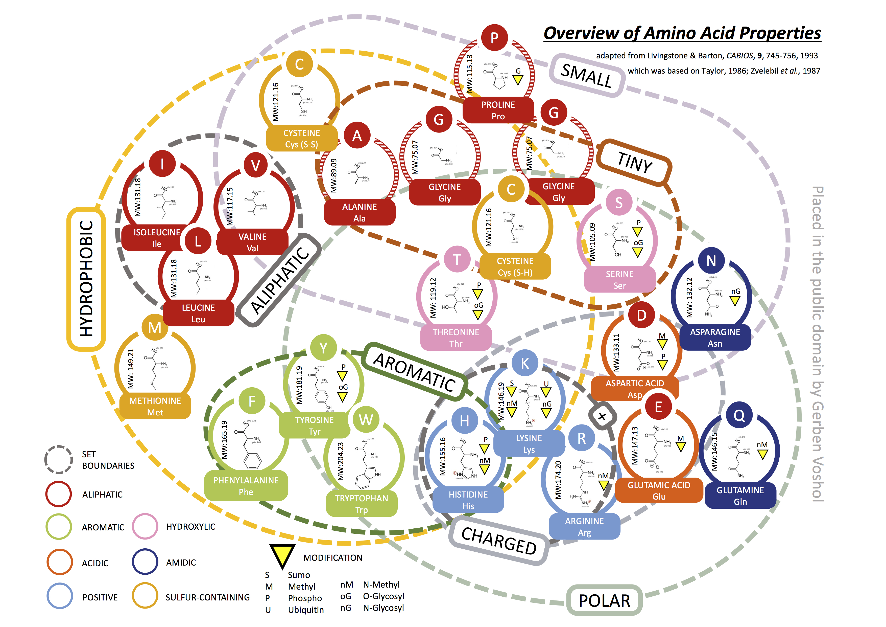
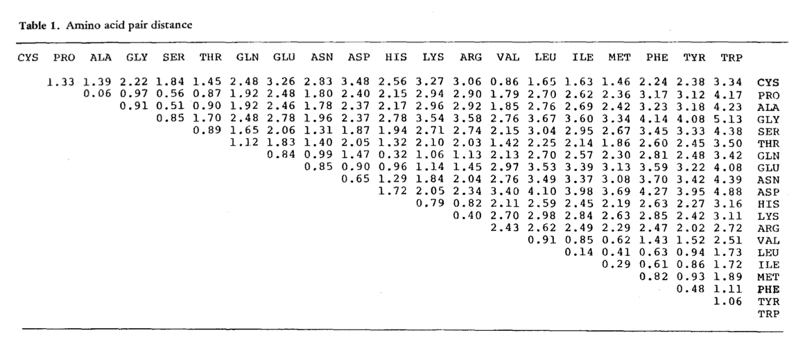

# Friday Week47

## Work plan
For this week's exercize, we will study the effect of protein evolution on tree inference. We will calculate the amino acid substitution matrix for each gene and correlate these values with physio-chemical properties of amino acids. 

### Background
Amino acids have various physio-chemical properties (such as polarity or volume) that determine their role in a preotein sequence.

>**Fig 1.** Amino acid properties.

We can assume that a gene experiences significant evolution if the amino acids substitutions occurring in the protein are between amino acids that differ significantly with respect to their properties. Substitutions between amino acids that are similar would have little effect and can therefore be considered neutral, while increasing difference between amino acids can cause significant beneficial or deleterious effects on protein function. This thought led scientists to come up with various measures that quantify differences between amino acids. You can have a look at some of these indices here: [link](https://www.genome.jp/aaindex/). For this exercize, we will be using one of the first amino acid dissimilarity matrices devised by [Miyata (1979)](https://link.springer.com/article/10.1007/BF01732340), based on amino acid volume and polarity.

>**Fig 2.** Miyata's dissimilariy matrix.

### Data files
#### 1. genes.txt
Download and unzip the data from [`genes.zip`](genes.zip). The folder contains amino acid alignments in fasta format for 8 genes across the 23 yeast species from the Rokas articles.
#### 2. Miyata amino acid similarity matrix.

### Strategy
#### 1.  Load the protein alignment into MEGA and estimate the amino acid substitution model.
#### 2.  Correlating sustitution rates between animno acids with physiochemical properties of amino acids.
#### 3.  Repeat for every gene.
#### 4.  Interpretation of differences between gene trees based on correlation strength.

### Questions
#### 1. 
