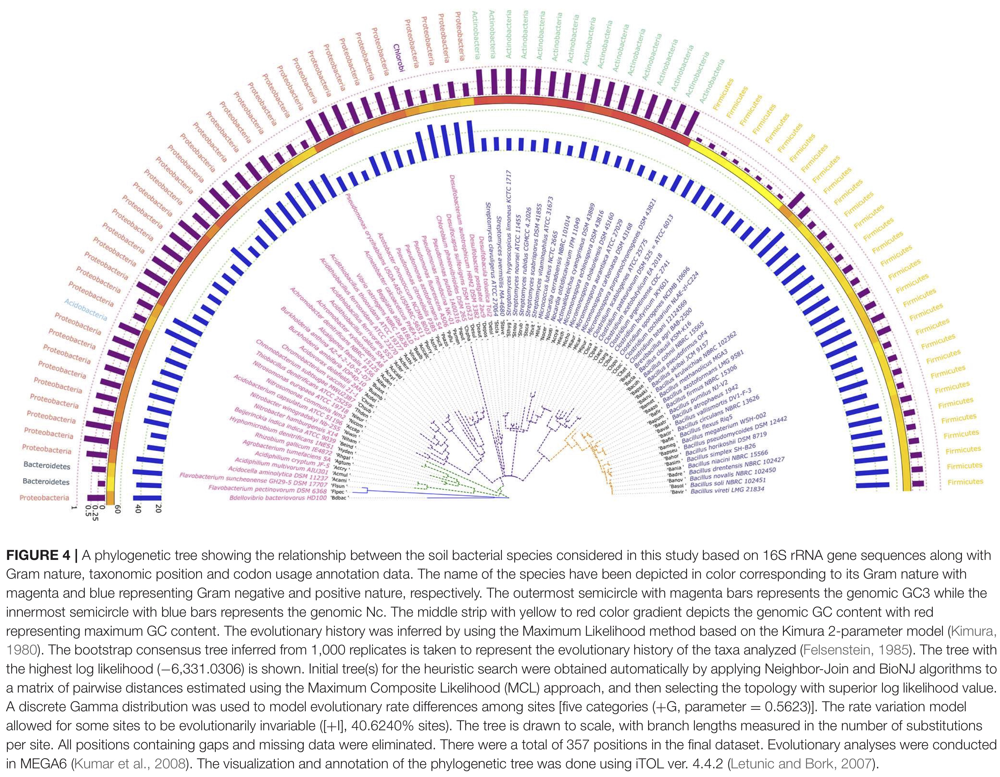

# Friday Week49
## Work plan
This week, we will be exploring GC3 content of 92 species of soil-dwelling bacteria. We will also learn about the effective number of codons (ENC) in bacteria.

## Background
### Codon usage across the tree of life
In mammals, and sexual organisms in general, codon usage is largely determined by the non-adaptive process of GC-biased gene conversion (gBGC), a recombination-associated repair of mismatches favouring GC nucleotides. However, in organisms with high effective population sizes, directional selection can more effectively act to optimize the codon repertoire of genes. This type of selection for codon usage is usually present in fast-growing organisms such as yeasts and bacteria, where specific codons confer higher transcription and/or translation efficiency of mRNA. Additionally, these organisms rarely recombine, making gBGC an unlikely determinant of their GC content. Often, highly expressed genes in bacteria have high translation efficiency that is usually achieved by selecting for codons whose corresponding tRNAs also occur at a high frequency in the cell. Generally, selection for codon usage in microorganisms results in efficient mRNA translation and protein production, and ultimately, faster growth.

### Effective number of codons (ENC)
Codon usage can be quantified by calculating the effective number of codons (ENC; [`Wright, 1990`](https://www.sciencedirect.com/science/article/pii/0378111990904919?via%3Dihub)) on a gene level, or summing over all coding sequences within a genome (i.e., species level). Put simply, the ENC parameter is the number of all the different codons used in a gene to encode the 20 amino acids (assuming that all amino acids can be found within a gene). For example, an extremely biased gene would have an ENC value of 20 such that only one codon is used per amino acid, whereas an unbiased gene would have an ENC value of 61 (i.e., all codons would be in use). Therefore, ENC quantifies how equally the synonymous codons are used within a gene sequnence.

Given the above definition of the effective number of codons, there is an emergent relationship between ENC and GC content at 3rd codon positions (GC3). Specifically, the average GC3 of a gene is an important determinant of the gene's ENC value. For example, if the average GC3 of a gene is around 50%, then we can assume that GC- and AT-ending codons will be approximately equally represented within a gene, thus maximizing the gene's ENC value. On the other hand, if the average GC3 of a gene is around 0% or 100%, then the gene will be comprised exclusively of AT- or GC-ending codons, respectively - the ENC value of such a gene will be close the minimal possible ENC value. In fact, [`Wright (1990)`](https://www.sciencedirect.com/science/article/pii/0378111990904919?via%3Dihub) derived a theoretical approximation for the relationship between the ENC value and average GC3 frequency for the case when mutation is the only force affecting GC3 content:

ENC = 2 + GC3 + {29/[GC3<sup>2</sup>+(1-GC3)<sup>2</sup>]}

### Soil-dwelling bacteria
Soil biomass is occupied by about 70% microorganisms which help in the decomposition of the soil organic matter and releasing the essential minerals on the soil surface. Each of the different types of bacteria residing in the soil have distinct morphological, physiological, biochemical, and ecological characteristics, and the variation in the structure and composition of different soil types impart a great influence on the diversity of the microbial community that the soil retains. Hence, microbes from different soil habitats must possess a variation in the genome structure and function to cope with this variability. We will be exploring a part of this genomic variablity (mainly GC3 context) of 92 species of bacteria. The data and the following phylogeny are from this study - [`link`](https://www.frontiersin.org/articles/10.3389/fmicb.2019.02896/full)



## Data
The [`data.txt.zip`](data.txt.zip) file you will be analyzing is a table containing 92 rows, each correspoding to a bacterial species, and the following columns: `Organism_name`, `Genome_size`, `GC_content` (GC-content of the whole genome), `Coding_bases` (percentage of coding bases in the genome), `Gram` (indicating if the species is gram-positive or gram-negative), `GC3` (average GC3 frequency across all coding sequences of the species), `GC3SD` (standard deviation of GC3, i.e. GC3 heterogeneity), `ENC` (ENC evaluated across all coding sequences of the species).

## Quick tutorial on `R` functions
For one of the questions you will need to program Wright's function into `R`. Here is an example of how `R` functions are structured. Two functions are demonstrated - the first one solves the equation y = x<sup>2</sup> and the second one solves y = x+z.

```{r}
# write functions
example_function1 <- function(x){
  return(x**2)
}

example_function2 <- function(x, z){
  return(x + z)
}

# run functions on single values
> example_function1(5)
[1] 25
> example_function2(4, 3)
[1] 7

# run function on vectors
> vec1 <- c(1, 2, 3, 4)
> example_function1(vec1)
[1]  1  4  9 16
> vec2 <- c(5, 6, 7, 8)
> example_function2(vec1, vec2)
[1]  6  8 10 12

```

## Strategy
Load the [`data.txt.zip`](data.txt.zip) into `R` and answer the questions. If you are unsure how to program functions in `R`, the [`examples.R.zip`](examples.R.zip) script contains the `Wright (1990)` function which you can use for your analysis. Additionally, this file contains examples on how to superimpose multiple plots in the same `ggplot` object.

## Questions
1. Load the soil-dwelling bacteria dataset into `R`. Report all pair-wise correlations between GC content, genome size and percentage of coding sequences.
2. Program Wright's function into `R` (last line in the "Effective number of codons" section). Run the function on an aribitrary range of GC3 values between 0 and 1. Plot GC3 vs. ENC values and describe the observation.
3. Plot the GC3 vs. ENC values of the soil-dwelling bacteria dataset. Superimpose Wright's function over the plot. Is the curve for GC3 vs. ENC values of the soil-dwelling bacteria above or below the curve of the Wright's function? What could be the explanation for this observation?
4. Color the points with respect to Gram status. What can you observe?
5. Calculate the correlation between ENC and standard deviation of GC3 for the bacteria dataset. Is the result expected and why?


